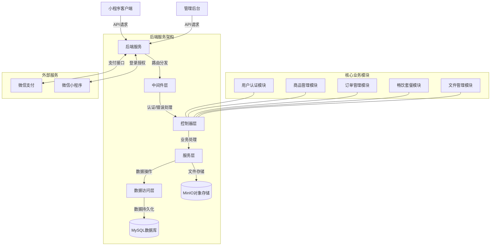
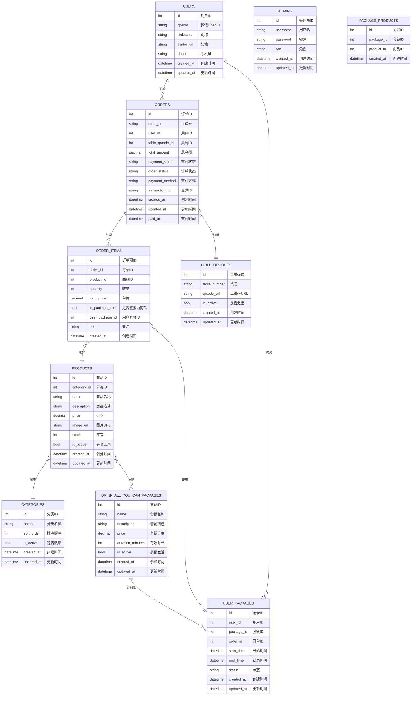
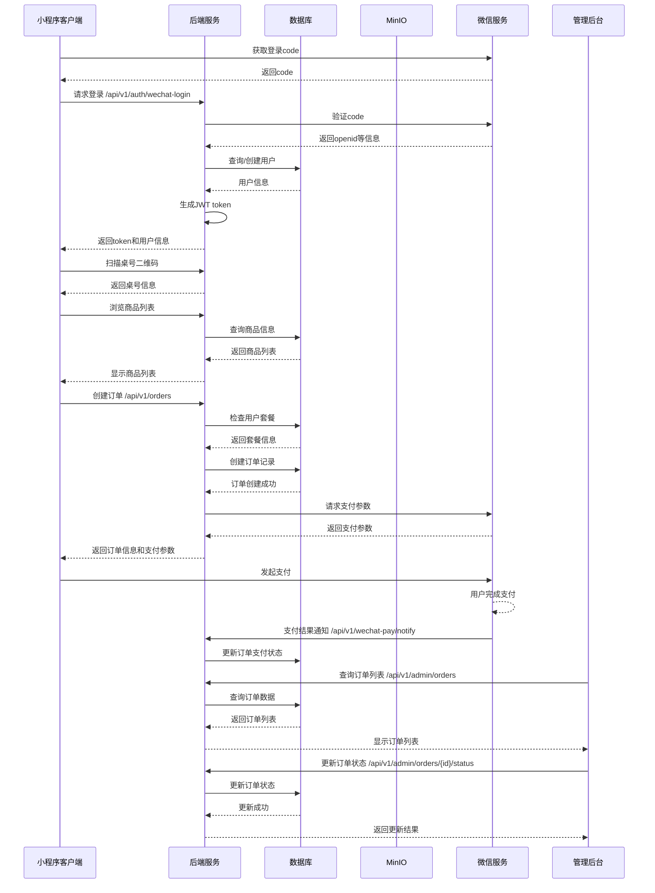
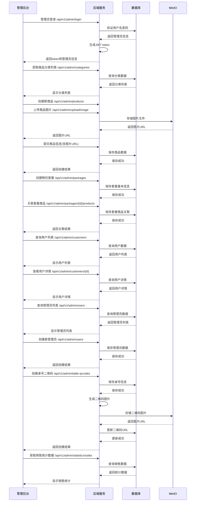
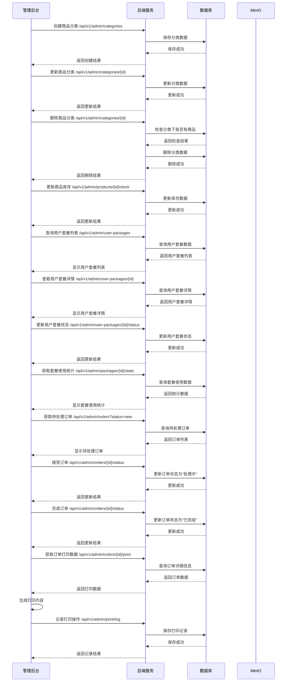

# Hi-Wine 酒水销售后台管理系统

## 1. 项目概述

Hi-Wine 是一个基于 GoFrame 框架开发的酒水销售后台管理系统，主要功能包括酒水商品管理、订单管理、畅饮套餐管理以及微信小程序用户管理等。系统分为管理后台和小程序客户端两部分，通过 RESTful API 进行通信。

### 1.1 技术栈

- 后端框架：GoFrame v2
- 数据库：MySQL
- 对象存储：MinIO
- 认证方式：JWT
- 微信小程序接入

### 1.2 项目特色

- 畅饮套餐功能：用户可以购买畅饮套餐，在有效期内享受套餐内指定酒水的免费服务
- 扫码点单：通过扫描桌号二维码进行点单
- 微信支付集成：支持微信支付完成订单
- 图片存储：使用 MinIO 对象存储服务管理商品图片

## 2. 系统架构

### 2.1 整体架构

系统采用经典的三层架构设计：

1. **表示层（Controller）**：负责处理 HTTP 请求和响应
2. **业务层（Service/Logic）**：实现业务逻辑
3. **数据访问层（DAO）**：负责数据库操作

#### 系统架构图



### 2.2 目录结构

```
├── api/                # API 定义
├── internal/           # 内部实现
│   ├── cmd/            # 命令行入口
│   ├── controller/     # 控制器
│   ├── dao/            # 数据访问对象
│   ├── logic/          # 业务逻辑
│   ├── model/          # 数据模型
│   │   ├── do/         # 数据对象
│   │   └── entity/     # 实体对象
│   ├── service/        # 服务接口
│   ├── middleware/     # 中间件
│   └── utility/        # 工具函数
├── manifest/           # 配置文件
│   └── config/         # 应用配置
├── resource/           # 静态资源
└── main.go             # 应用入口
```

## 3. 核心功能模块

### 3.1 用户认证模块

#### 3.1.1 微信小程序用户登录

- 通过微信授权码（code）进行登录
- 生成 JWT token 用于后续接口认证
- 自动注册新用户

#### 3.1.2 管理员登录

- 基于用户名和密码的管理员登录
- 不同角色的权限控制

### 3.2 商品管理模块

#### 3.2.1 商品分类

- 分类的增删改查
- 分类排序管理

#### 3.2.2 商品信息

- 商品的增删改查
- 商品库存管理
- 商品图片上传（MinIO存储）

### 3.3 畅饮套餐模块

#### 3.3.1 套餐管理

- 套餐的增删改查
- 套餐包含商品管理

#### 3.3.2 用户套餐

- 用户购买套餐
- 套餐使用记录
- 套餐有效期管理

### 3.4 订单管理模块

#### 3.4.1 订单创建

- 扫码下单
- 畅饮套餐优惠处理
- 库存检查和扣减

#### 3.4.2 订单处理

- 订单状态管理（新订单、处理中、已完成、已取消）
- 支付状态管理（待支付、已支付、已退款）

#### 3.4.3 支付集成

- 微信支付接入
- 支付回调处理

### 3.5 文件管理模块

- MinIO 对象存储集成
- 图片上传和访问

## 4. 数据库设计

### 4.1 核心表结构

#### 数据库关系图



#### 4.1.1 用户表 (users)

- id: 用户ID
- openid: 微信OpenID
- nickname: 用户昵称
- avatar_url: 头像URL
- phone: 手机号
- created_at: 创建时间
- updated_at: 更新时间

#### 4.1.2 管理员表 (admins)

- id: 管理员ID
- username: 用户名
- password: 密码（加密存储）
- role: 角色
- created_at: 创建时间
- updated_at: 更新时间

#### 4.1.3 商品分类表 (categories)

- id: 分类ID
- name: 分类名称
- sort_order: 排序顺序
- is_active: 是否激活
- created_at: 创建时间
- updated_at: 更新时间

#### 4.1.4 商品表 (products)

- id: 商品ID
- category_id: 所属分类ID
- name: 商品名称
- description: 商品描述
- price: 商品价格
- image_url: 商品图片URL
- stock: 库存数量
- is_active: 是否上架
- created_at: 创建时间
- updated_at: 更新时间

#### 4.1.5 畅饮套餐表 (drink_all_you_can_packages)

- id: 套餐ID
- name: 套餐名称
- description: 套餐描述
- price: 套餐价格
- duration_minutes: 有效时长（分钟）
- is_active: 是否激活
- created_at: 创建时间
- updated_at: 更新时间

#### 4.1.6 套餐商品关联表 (package_products)

- id: 关联ID
- package_id: 套餐ID
- product_id: 商品ID
- created_at: 创建时间

#### 4.1.7 用户套餐表 (user_packages)

- id: 记录ID
- user_id: 用户ID
- package_id: 套餐ID
- order_id: 订单ID
- start_time: 开始时间
- end_time: 结束时间
- status: 状态（active, expired, cancelled）
- created_at: 创建时间
- updated_at: 更新时间

#### 4.1.8 订单表 (orders)

- id: 订单ID
- order_sn: 订单号
- user_id: 用户ID
- table_qrcode_id: 桌号二维码ID
- total_amount: 订单总金额
- payment_status: 支付状态
- order_status: 订单状态
- payment_method: 支付方式
- transaction_id: 微信支付交易ID
- created_at: 创建时间
- updated_at: 更新时间
- paid_at: 支付时间

#### 4.1.9 订单项表 (order_items)

- id: 订单项ID
- order_id: 订单ID
- product_id: 商品ID
- quantity: 数量
- item_price: 单价
- is_package_item: 是否套餐内商品
- user_package_id: 关联的用户套餐ID
- notes: 备注
- created_at: 创建时间

#### 4.1.10 桌号二维码表 (table_qrcodes)

- id: 二维码ID
- table_number: 桌号
- qrcode_url: 二维码URL
- is_active: 是否激活
- created_at: 创建时间
- updated_at: 更新时间

### 4.2 数据关系

- 一个用户可以有多个订单
- 一个用户可以购买多个畅饮套餐
- 一个畅饮套餐可以包含多个商品
- 一个订单包含多个订单项
- 一个商品属于一个分类

## 5. API 接口设计

系统提供 RESTful API，主要分为以下几类：

### 5.1 公开接口

- 商品查询：`/api/public/*`
- 套餐查询：`/api/public/*`

### 5.2 认证接口

- 微信登录：`/api/v1/auth/wechat-login`
- 管理员登录：`/api/v1/admin/login`

### 5.3 用户接口

- 用户信息：`/api/v1/user/profile`
- 用户订单：`/api/v1/user/orders`
- 用户套餐：`/api/v1/user/packages`

### 5.4 订单接口

- 创建订单：`/api/v1/orders`
- 订单详情：`/api/v1/orders/{order_id}`

### 5.5 管理后台接口

- 商品管理：`/api/v1/admin/products/*`
- 分类管理：`/api/v1/admin/categories/*`
- 套餐管理：`/api/v1/admin/packages/*`
- 订单管理：`/api/v1/admin/orders/*`
- 用户套餐管理：`/api/v1/admin/user-packages/*`
- 文件上传：`/api/v1/admin/upload/*`

### 5.6 主要业务流程

以下是系统中几个关键业务流程的时序图：







## 6. 中间件

### 6.1 JWT认证中间件

- 验证请求头中的 Authorization token
- 解析 token 中的用户信息
- 将用户ID写入请求上下文

### 6.2 响应包装中间件

- 统一响应格式
- 错误码标准化

### 6.3 错误处理中间件

- 全局异常捕获
- 友好的错误响应

## 7. 部署说明

### 7.1 环境要求

- Go 1.16+
- MySQL 5.7+
- MinIO 服务

### 7.2 配置说明

在 `manifest/config/config.yaml` 文件中配置：

```yaml
# 服务器配置
server:
  address: "0.0.0.0:8000"
  openapiPath: "/api.json"
  swaggerPath: "/swagger"
  url: "http://localhost:8000"

# 日志配置
logger:
  level: "all"
  stdout: true

# 数据库配置
database:
  default:
    link: "mysql:root:password@tcp(127.0.0.1:3306)/hi-wine?loc=Local&parseTime=true"

# JWT配置
jwt:
  secret: "hi-wine-jwt-secret-key"
  expire: 86400  # 过期时间，单位：秒（24小时）

# 微信配置
wechat:
  appid: "your_appid"
  secret: "your_secret"

# MinIO配置
minio:
  endpoint: "127.0.0.1:9000"
  accessKey: "minioadmin"
  secretKey: "minioadmin"
  useSSL: false
  bucketName: "hi-wine"
  region: ""
  domain: ""  # 留空，使用默认URL格式
```

### 7.3 启动步骤

1. 安装依赖：`go mod tidy`
2. 编译项目：`go build -o hi-wine`
3. 启动服务：`./hi-wine`

### 7.4 Docker 部署

可以使用 Docker 和 Docker Compose 进行容器化部署，包含以下服务：

- hi-wine 应用服务
- MySQL 数据库
- MinIO 对象存储

## 8. 扩展功能建议

1. 会员积分系统
2. 商品评价功能
3. 促销活动管理
4. 数据统计与分析
5. 库存预警与补货管理
6. 员工管理与权限细分
7. 多语言支持

## 9. 总结

Hi-Wine 酒水销售后台管理系统是一个功能完善的酒水销售解决方案，特别适合酒吧、酒馆等场所使用。系统通过畅饮套餐功能提供了差异化的营销方式，通过扫码点单提升了用户体验，同时后台管理功能全面，便于商家进行日常运营管理。 